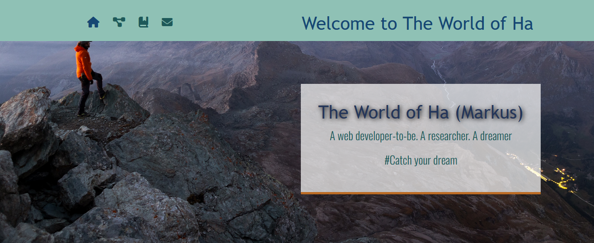
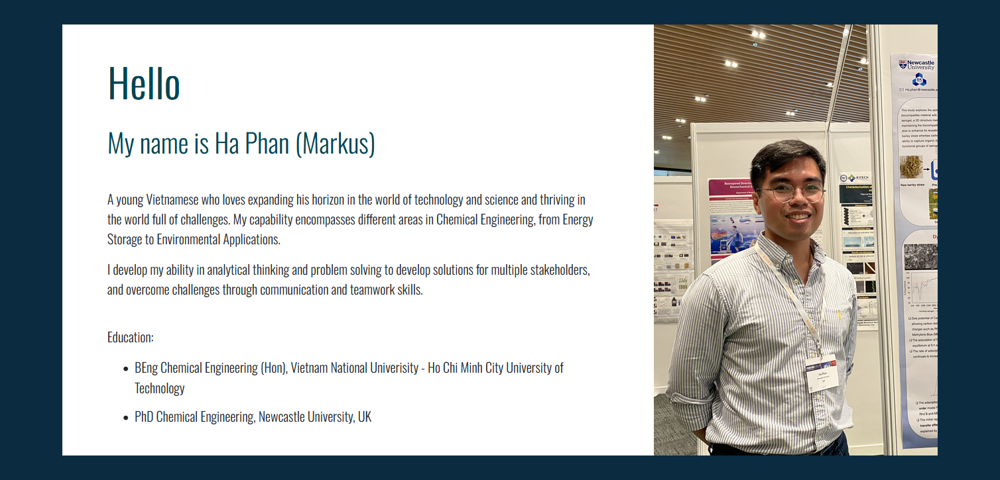
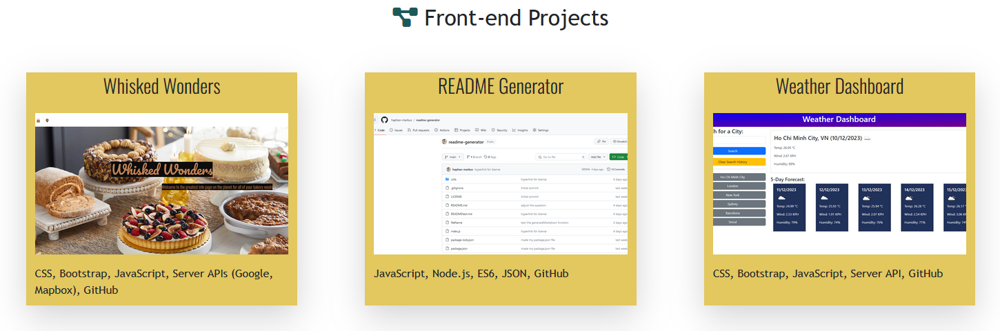
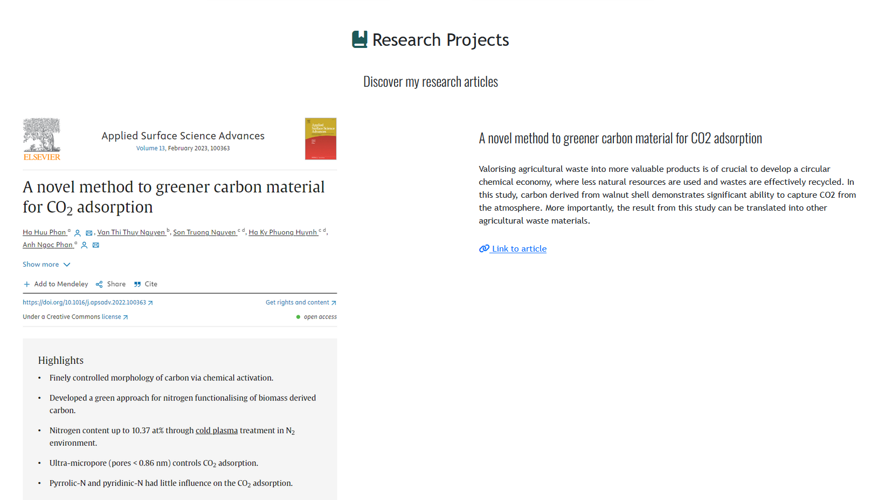
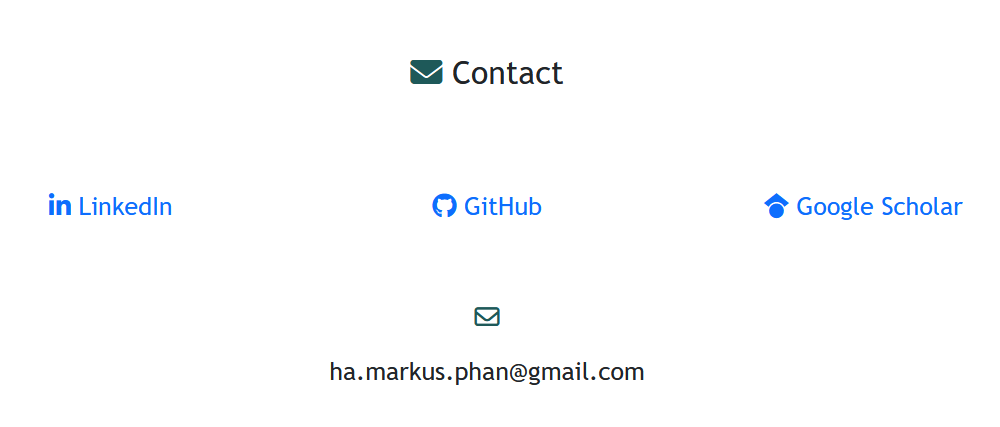

# Portfolio

Welcome to the portfolio of me - Ha Phan as a Front-end developer. The portfolio presents information regarding my background, personal contacts, my projects developed as a Front-end developer, and publications from my other research projects.

## User story

```
As a user,
I WANT to explore the interesting achievements and projects of this owner of this portfolio and his personality,
So we can collaborate on future projects in software engineering.
```

## Usage

The deployed website link: https://haphan-markus.github.io/Portfolio/

The links to GitHub repositories and research works are embedded in section "Front-end Projects" and "Research Projects". Upon being clicked, the link will lead you to the original documents.

## Visual

Spanner section


Introduction


Front-end projects


Research projects


Contact


## Licence

[MIT](https://choosealicense.com/licenses/mit/)